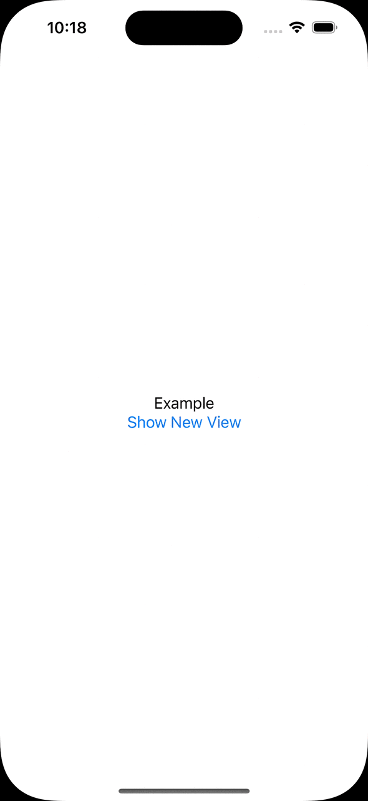

# TCA Transitions

## 📝 Description

This package adds simple transitions using [The Composable Architecture](https://github.com/pointfreeco/swift-composable-architecture) from [Point-Free](https://www.pointfree.co). SwiftUI allows for expressive transitions and ways to navigate the user to a new screen. This package aims to make these transitions easier.

### Installation 

Install in Xcode as a package dependency.
  1. From the **File** menu, select **Add Packages...**
  2. Enter "https://github.com/Naturally-Inviting/swift-tca-transitions" into the package URL field.
     
### Demo

This demo application can be accessed via `TcaTransitions.xcworkspace`

## Examples

### Circle Transition

```swift
import TCATransitions

ZStack {
  // Content "underneath" the new transition
  MyRootView()
  
  // The content presented during the transition
  MyNewPresentedView()
    .circleTransition(
      scopedStore, 
      style: Color.red.gradient
    )
}
```

|Circle Transition|
|:-:|
||
